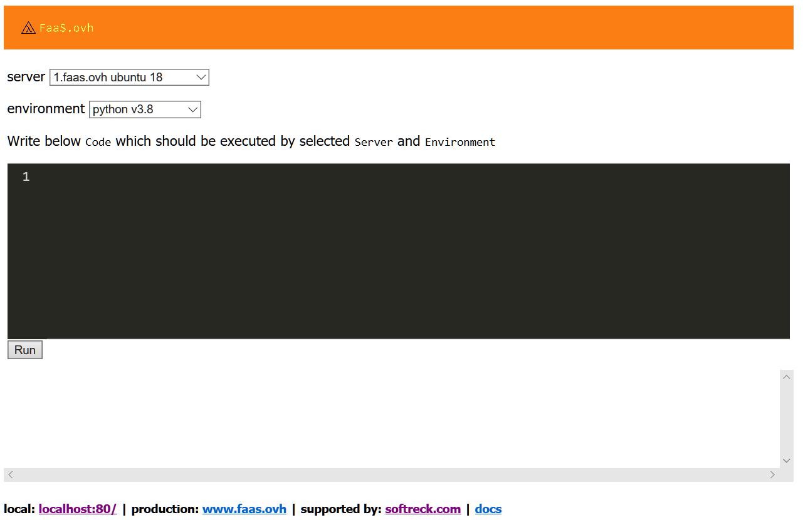

# [faas.ovh](https://docs.faas.ovh)

https://github.com/faas-ovh

## APIfoundation + APIfunc = FaaS.ovh

Apifoundation z zasady jest otwarte i lokalne.

Przyśpiesza proces dostarczania aplikacji, od momentu przygotowania serwera, środowiska do uruchomienia pierwszej wersji API.
 
Pozwala na deployment w dowolnym urządzeniu z numerem IP po SSH, czyli też IOT jak RaspberryPI.
Przygotowanie środowiska polega na uruchomieniu skryptów w natywnym środowisku systemu.
Skrypty powłoki bash zawierają też funkcje testujące i sprawdzające pozwalając na interakcję.

APIfoundation jest realizowane na lokalne potrzeby w celu szybkiego dostarczenia pierwszej wersji prototypu na lokalnych, fizycznych serwerach/urządzeniach.

Pierwszy szkic aplikacji jest dostępny online: https://www.faas.ovh/

## Status

Twrają prace dostarczenie wersji generującej z pojedynczej funkcji dokumentację API w formacie OpenAPI + działająca usługa na określonym serwerze w określonym środowisku. 

Gdy generowanie API z funkcji będzie gotowe.
Kolejnym modułem będzie generowanie frontendu dla potrzeb tego API, czyli statycznej aplikacji np formularza, tabelki.

Te wszystkie elementy wymagają jeszcze testowania, dlatego wersja finalna będzie dostępna za kilka miesięcy. 

## Co to jest FaaS

[Function as a service - Wikipedia](https://en.wikipedia.org/wiki/Function_as_a_service)

## Czym jest faas.ovh?

Celem tego rozwiązania jest przygotowanie srodowiska do wykonania kodu jednej prostej funkcji dla dowolnego języka programowania z listy:
+ javascript/nodeJS
+ python
+ php
+ ...

Bazą jest usługa Serwera, obecnie może to być synchroniczna WSGI, asynchroniczne platformy Twisted i Tornado, lub po prostu NodeJS.

+ Serwer WSGI
+ Twisted, Tornado
+ NodeJS

## Kod
Funkcja powinna zawierać nazwe, parametry w formacie tekstowym, wynik jest przetwarzany do postaci JSON

## Code to API conversion based on generated OpenApi documentation
Na podstawie analizy funkcji w okienku edytora zostaje wygenerowana dokumentacja
  

# Zasada działania aplikacji

Z założenia jest to lokalne 

# Informacje dodatkowe o bibliotekach
 

## Serwer WSGI
+ [Web Server Gateway Interface - Wikipedia](https://en.wikipedia.org/wiki/Web_Server_Gateway_Interface)

Serwer WSGI pozwala uruchamiać kilka wątków jednocześnie, co umożliwia równoległe obsługiwanie zapytań, jednak nie można uruchamiać tysięcy wątków.  Gdy ich pula się wyczerpie to kolejne zapytanie zostanie wstrzymane, mimo że mikrousługa nie wykonuje żadnych operacji i czeka na odpowiedź innej usługi w tle.

## [Twisted engine](https://twistedmatrix.com/trac/)

W kodzie opartym na platformie Twisted wykorzystywane są funkcje zwrotne wstrzymujące i wznawiające pracę podczas przygotowywania odpowiedzi na zapytanie.  
Ten model skraca okresy bezczynności procesu, a aplikacja może obsługiwać tysiące zapytań.  
Nie oznacza to, że szybciej odpowiada na zapytania, a że jeden proces może odbierać więcej jednoczesnych zapytań i odpowiadać na nie w miarę otrzymywania niezbędnych danych.

## [Biblioteka Greenlet](https://github.com/python-greenlet/greenlet)
jest pakietem utworzonym w języku Stackless (szczególnej implementacji CPython) oferującym tzw. greenlety.

Greenlety to pseudowątki, które mogą wywoływać funkcje w języku Python, które mogą przełączać konteksty i przekazywać sterowanie innym funkcjom.  
Przełączanie kontekstu odbywa się w pętli zdarzeń, dzięki czemu można tworzyć asynchroniczne aplikacje podobne do aplikacji wielowątkowych.

Kod mikrousïugi wykorzystujÈcy standard WSGI i greenlety może obsługiwać wiele żądań jednocześnie i przełączać się pomiędzy nimi.  
Jednak przełączanie pomiędzy greenlet-ami odbywa się jawnie, a to powoduje, że kod szybko się komplikuje a przez to staje nieczytelny.

## [Biblioteka Gevent](https://www.gevent.org)
Gevent jest oparty o Greenlet i oferuje między innymi automatyczne przełączanie kodu między greenletami.

## [Asynchroniczna platforma Tornado](https://www.tornadoweb.org)

Platforma Twisted jest wyjątkowo spójna i wydajna, jednak:
+ Każdy punkt końcowy mikrousługi trzeba implementowaÊ za pomocą klasy pochodnej od Resource i kodować wszystkie jej metody ( trzeba napisać kod interfejsu API )
+ Kod jest mało czytelny i trudny w diagnozowaniu ze względu na jego asynchroniczność
+ W przypadku długiego łańcucha funkcji zwrotnych (callback) wywołanych jedna po drugiej łatwo jest wpaść zależne wywołania przez to trudno jest przetestować aplikację i do tego celu trzeba używać specjalnego modułu do testów jednostkowych.

## [Moduł asyncio](https://docs.python.org/3/library/asyncio.html)

implementacja jawnej pętli zdarzeń okazuje się lepszym rozwiązaniem od mechanizmu oferowanego przez bibliotekę Gevent.

Instrukcje async i await implementujące koprocedury sprawiły, że asynchroniczny kod napisany w języku Python 3.5 jest bardzo czytelny i podobny do kodu synchronicznego.

# [API Foundation](https://www.apifoundation.com)

Projekt faas.ovh jest wspierany przez [API Foundation](https://www.apifoundation.com)

Wystartowaliśmy w roku 2018 z kilkoma pomysłami ale jedną ideą:
+ szybsze wytwarzanie orogramowania

Dziś, w roku 2020 dajemy rozwiązania w kilku obszarach:

+ [APIexec - executor library for shell scripts](https://www.apiexec.com)
+ [APIcra - shell scripts libraries](https://www.apicra.com)
+ [APIunit - definition of application, CI, CD](https://www.apiunit.com)
+ [APIbuild - build process definition, focused on quality, versioning](https://www.apibuild.com)
+ [APIsql - bazy danych, zapytania, modele](https://www.apisql.com)
+ [faas.ovh - rozwiązania dla FaaS](https://www.faas.ovh)
